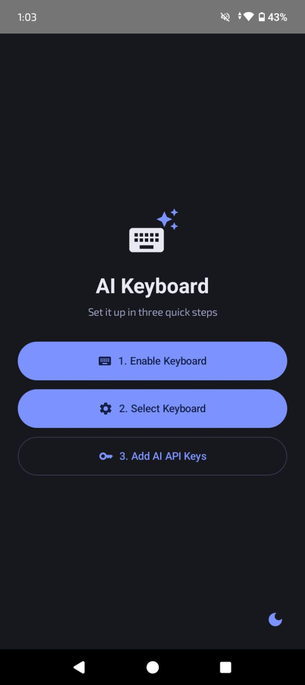
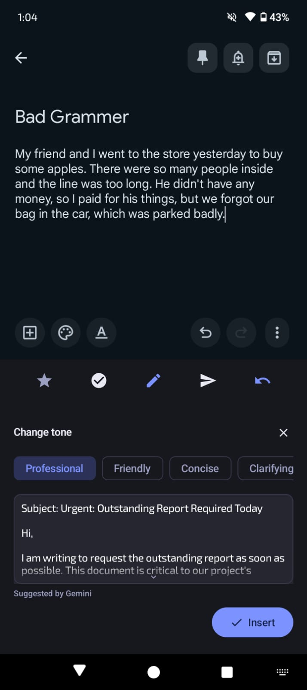
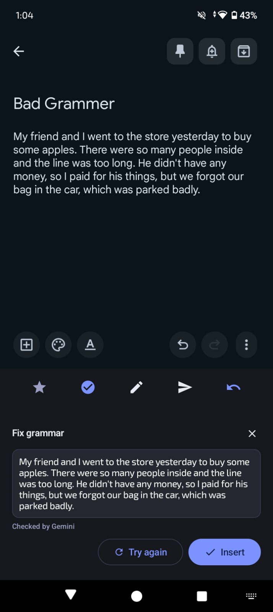
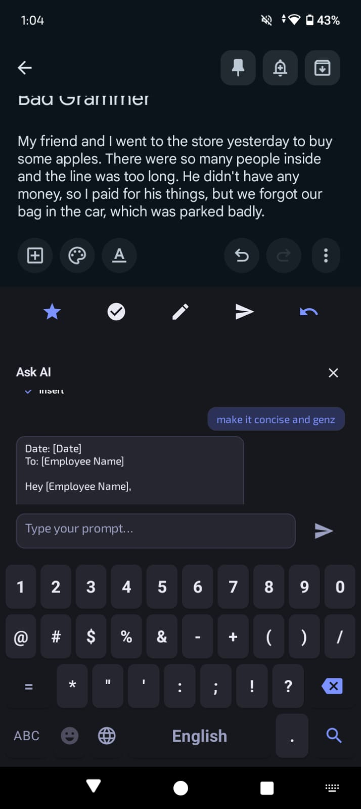
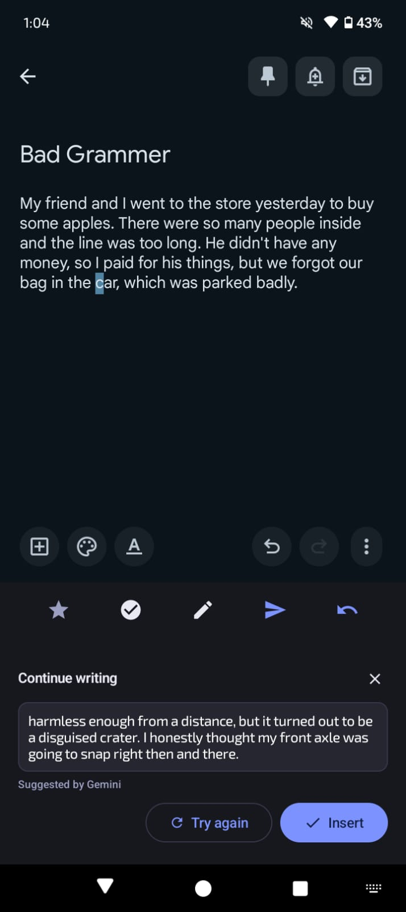
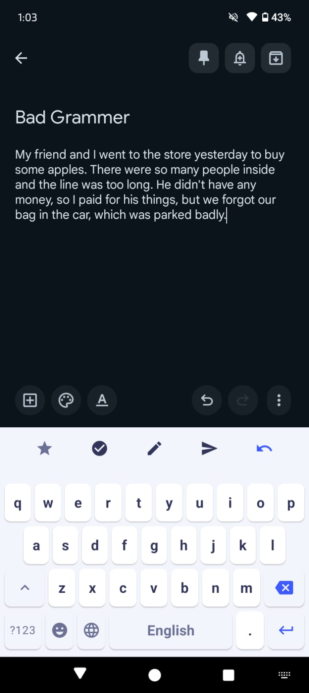
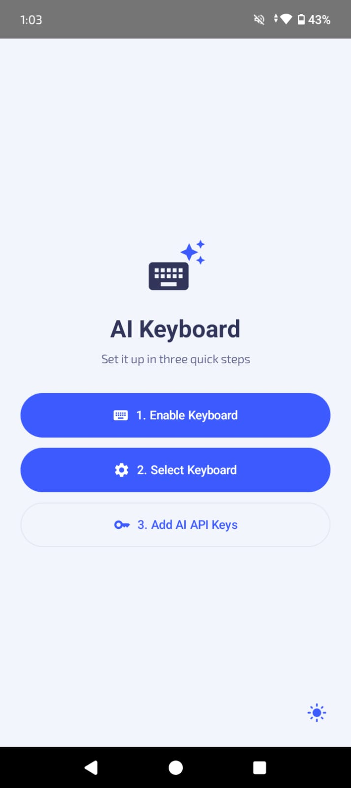

# AI Keyboard

A custom Android keyboard (IME) built with Jetpack Compose that puts four AI-powered writing
tools — tone rewriting, grammar fixing, continuation, and a chat assistant — directly on the
keys, without ever leaving the app you're typing into.

It's backed by a multi-provider AI router that automatically fails over between Gemini,
DeepSeek, and ChatGPT, so a single provider hitting its free-tier rate limit doesn't take the
whole feature down.



---

## Features

- **Tone Rewrite** — pick from 7 tones (Professional, Friendly, Concise, Confident, Empathetic,
  Formal, Witty); preview the rewrite before it touches your text.
- **Grammar Fix** — one-tap spelling/grammar/punctuation correction, with a "no mistakes found"
  state so it doesn't feel like it's making work up.
- **Continue Writing** — suggests 1–3 sentences that continue naturally from what you've already
  typed, appended at the cursor rather than replacing anything.
- **AI Chat** — a full chat popup, typed with the keyboard's own keys (see
  [Architecture Highlights](#architecture-highlights) for how that works without a keyboard-inside-a-keyboard
  problem), with per-reply "Insert" buttons.
- **Undo, everywhere** — every AI insert snapshots your field's full text first. One tap restores
  it if the AI got it wrong.
- **Built-in emoji picker** and a **numbers/symbols panel** (two pages, like a standard system
  keyboard).
- **Light & dark themes** — a strict two-surface (white / greyish-black) plus one blue accent
  design system, not tied to Android's wallpaper-based dynamic color.
  
- **Bring-your-own-keys** — API keys are entered in-app and stored with `EncryptedSharedPreferences`;
  nothing is hardcoded or sent anywhere except the provider you configured.

## How It Works — Multi-Provider AI

All four features go through one `AiRouter`. It holds your configured providers in priority
order (Gemini → DeepSeek → ChatGPT), skips anything currently in a rate-limit cooldown, and
tries each until one succeeds:


## Tech Stack

- **Kotlin** + **Jetpack Compose** (Material 3)
- **Android `InputMethodService`** for the keyboard itself
- **OkHttp** + `org.json` for provider API calls (no serialization plugin needed)
- **Coroutines / StateFlow** for async AI calls and UI state
- **AndroidX Security (`EncryptedSharedPreferences`)** for API key storage
- **AndroidX Lifecycle ViewModel**, wired into `InputMethodService` via `ViewModelStoreOwner`

## Project Structure

```
app/src/main/java/com/example/aikeyboard/
├── ai/                       # Provider-agnostic AI layer
│   ├── AiRouter.kt           # Multi-provider failover orchestrator
│   ├── AiClient.kt           # Common interface + exception types
│   ├── GeminiClient.kt       # Google Gemini (generateContent API)
│   ├── DeepSeekClient.kt     # DeepSeek (OpenAI-compatible chat completions)
│   ├── ChatGptClient.kt      # OpenAI chat completions
│   ├── ProviderCooldownStore.kt  # 5-min cooldown after a 429
│   ├── TokenEstimator.kt     # Dynamic maxOutputTokens from input length
│   └── AiModels.kt           # Request/Result/Error types
├── data/
│   └── ApiKeyStore.kt        # Encrypted BYOK key storage
├── keyboard/
│   ├── AIKeyBoard.kt         # Main composable: toolbar + key area routing
│   ├── AIKeyboardKey.kt      # Single key (text/icon, redirectable input)
│   ├── KeyboardViewModel.kt  # All AI panel state + feature logic
│   ├── ToneMenuPanel.kt / GrammarCheckPanel.kt / ContinuePanel.kt / ChatPanel.kt
│   ├── EmojiPanel.kt / SymbolsPanel.kt
│   └── PreviewComponents.kt  # Shared scrollable preview box + provider caption
├── service/
│   ├── KeyboardService.kt    # InputMethodService, Compose lifecycle plumbing
│   ├── TextFieldAccessor.kt  # InputConnection read/replace/undo-snapshot helpers
│   └── KeyAction.kt / performKeyAction()
└── ui/theme/                 # Color.kt / Theme.kt / Type.kt — light & dark
```

## Getting Started

1. Clone the repo and open it in Android Studio.
2. Build and install the app — it's a normal launcher app that also registers a keyboard.
3. On first launch: **Enable Keyboard** → **Select Keyboard** → **Add AI API Keys**.
4. Add at least one API key (Gemini has a genuine free tier; DeepSeek and OpenAI are
   pay-as-you-go — see the note in Settings). You only need one for the keyboard to work; add
   more for automatic failover.
5. Switch to the AI Keyboard in any text field and try the toolbar icons.

## Architecture Highlights for nerds

A few decisions worth calling out if you're reading the code:

- **Typing into your own popup.** An IME can't pop up the system keyboard to type into itself —
  it *is* the system keyboard. The Chat panel solves this by reusing the same QWERTY key rows,
  with an optional `onKeyAction` redirect so key presses go into a local chat draft instead of
  the real `InputConnection` while the panel is open.
- **Preview before insert, everywhere.** No AI feature writes to your text field until you
  explicitly tap Insert. Early on, inserting immediately turned out to feel unsafe — this fixed
  it, and made the undo feature natural to add on top.
- **Non-destructive panel state.** Closing and reopening a panel doesn't lose your tone preview
  or chat history — only an explicit action clears it.
- **Dynamic token budgets.** `maxOutputTokens` is estimated from input length (with headroom)
  instead of a fixed number, so short edits don't over-pay in latency and long ones don't get
  truncated.


## Contributing

Issues and PRs welcome. If you're changing the AI layer, `ai/AiRouter.kt` and
`ai/AiClient.kt` are the two files to read first.
